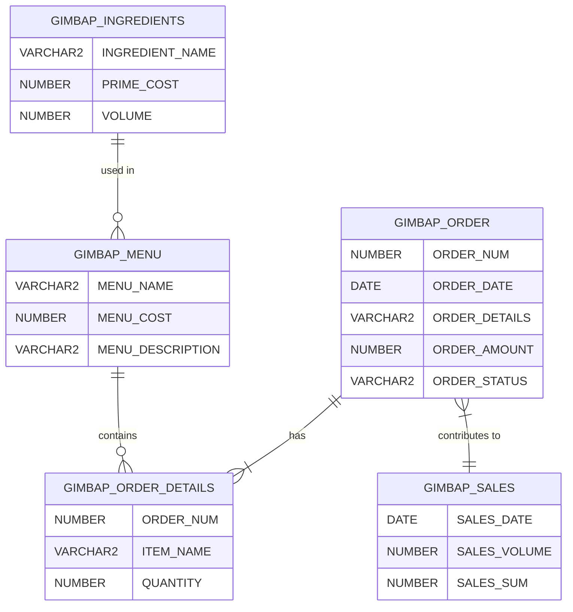
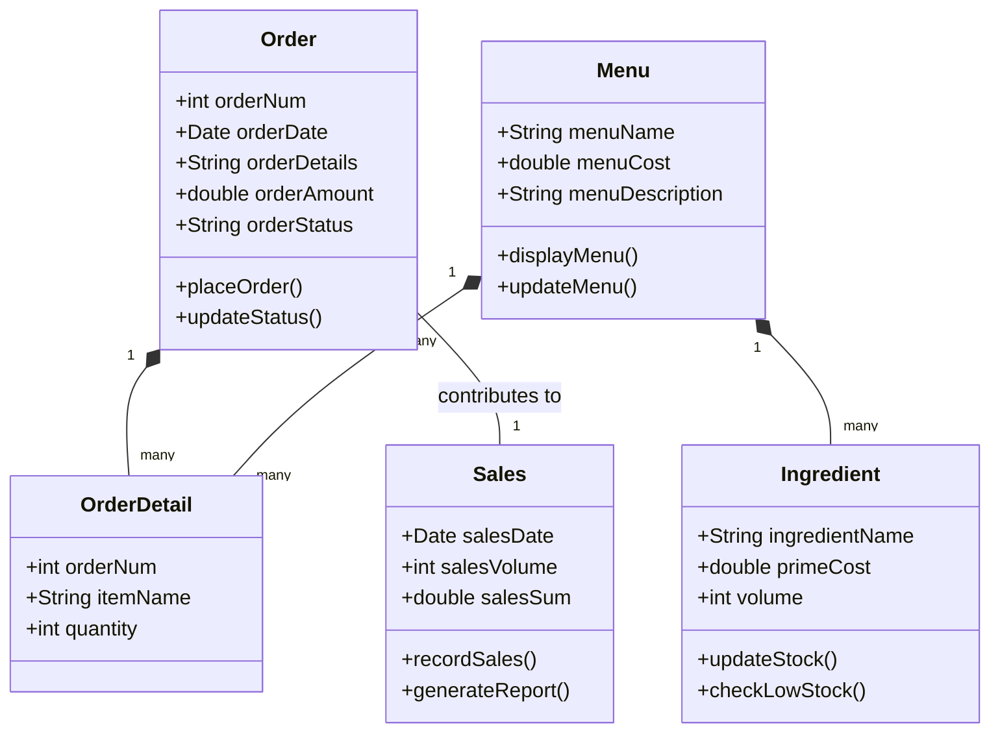
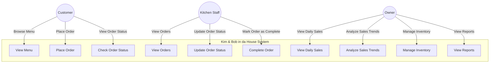
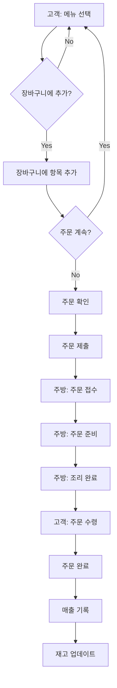

# Kim & Bob in da House (그룹웨어 프로젝트)

## 목차
1. [프로젝트 개요](#프로젝트-개요)
2. [주요 기능](#주요-기능)
3. [기술 스택](#기술-스택)
4. [설치 및 실행 방법](#설치-및-실행-방법)
5. [프로젝트 구조](#프로젝트-구조)
6. [데이터베이스 스키마](#데이터베이스-스키마)
7. [데이터베이스 ERD](#데이터베이스-erd)
8. [시스템 UML 클래스 다이어그램](#시스템-uml-클래스-다이어그램)
9. [시스템 유스케이스 다이어그램](#시스템-유스케이스-다이어그램)
10. [주문 처리 Activity 다이어그램](#주문-처리-activity-다이어그램)
11. [개발 로그](#개발-로그)
12. [향후 계획](#향후-계획)
13. [문의 및 기여](#문의-및-기여)
14. [라이선스](#라이선스)

## 프로젝트 개요

Kim & Bob in da House는 김밥 전문점을 위한 종합 관리 시스템입니다. 이 프로젝트는 고객 주문, 주방 관리, 그리고 사장님 대시보드 기능을 제공하여 효율적인 매장 운영을 지원합니다.

## 주요 기능

1. 고객 페이지 (/customer)
   - 메뉴 조회 및 주문 기능
   - 장바구니 관리
   - 주문 완료 알림

2. 주방 페이지 (/kitchen)
   - 실시간 주문 확인
   - 주문 처리 상태 관리
   - 조리 완료 처리

3. 사장님 페이지 (/boss)
   - 일별 매출 정보 조회
   - 기간별 판매 추이 분석
   - 재고 현황 관리

## 기술 스택

- Backend: Node.js, Express
- Database: Oracle DB
- Frontend: HTML, CSS, JavaScript
- 추가 라이브러리: Chart.js (데이터 시각화)

## 설치 및 실행 방법

1. 프로젝트 클론:
   ```
   git clone [repository-url]
   cd kim-and-bob-in-da-house
   ```

2. 의존성 설치:
   ```
   npm install
   ```

3. 데이터베이스 설정:
   - Oracle DB 설치 및 구성
   - `server.js` 파일에서 데이터베이스 연결 정보 수정

4. 서버 실행:
   ```
   node server.js
   ```

5. 브라우저에서 다음 URL 접속:
   - 고객 페이지: http://localhost:3000/customer
   - 주방 페이지: http://localhost:3000/kitchen
   - 사장님 페이지: http://localhost:3000/boss

## 프로젝트 구조

```
kim-and-bob-in-da-house/
│
├── server.js                # 메인 서버 파일
├── package.json             # 프로젝트 의존성 정보
│
├── public/                  # 정적 파일 디렉토리
│   ├── customer.html        # 고객 페이지 HTML
│   ├── kitchen.html         # 주방 페이지 HTML
│   ├── boss.html            # 사장님 페이지 HTML
│   │
│   ├── customer_script.js   # 고객 페이지 JavaScript
│   ├── kitchen_script.js    # 주방 페이지 JavaScript
│   ├── boss_script.js       # 사장님 페이지 JavaScript
│   │
│   ├── customer_styles.css  # 고객 페이지 스타일
│   ├── kitchen_styles.css   # 주방 페이지 스타일
│   └── boss_styles.css      # 사장님 페이지 스타일
│
└── README.md                # 프로젝트 설명 문서
```

## 데이터베이스 스키마

이 프로젝트는 Oracle 데이터베이스를 사용하며, 다음과 같은 테이블 구조를 가지고 있습니다:

### 1. gimbap_ingredients (재료 정보)
| 컬럼명 | 데이터 타입 | 설명 |
|--------|-------------|------|
| INGREDIENT_NAME | VARCHAR2(20 BYTE) | 재료 이름 |
| PRIME_COST | NUMBER | 원가 |
| VOLUME | NUMBER | 재고량 |

### 2. gimbap_menu (메뉴 정보)
| 컬럼명 | 데이터 타입 | 설명 |
|--------|-------------|------|
| MENU_NAME | VARCHAR2(50 BYTE) | 메뉴 이름 |
| MENU_COST | NUMBER | 메뉴 가격 |
| MENU_DESCRIPTION | VARCHAR2(200 BYTE) | 메뉴 설명 |

### 3. gimbap_order (주문 정보)
| 컬럼명 | 데이터 타입 | 설명 |
|--------|-------------|------|
| ORDER_NUM | NUMBER | 주문 번호 |
| ORDER_DATE | DATE | 주문 날짜 |
| ORDER_DETAILS | VARCHAR2(100 BYTE) | 주문 상세 내역 |
| ORDER_AMOUNT | NUMBER | 주문 총액 |
| ORDER_STATUS | VARCHAR2(20 BYTE) | 주문 상태 |

### 4. gimbap_order_details (주문 상세 정보)
| 컬럼명 | 데이터 타입 | 설명 |
|--------|-------------|------|
| ORDER_NUM | NUMBER | 주문 번호 |
| ITEM_NAME | VARCHAR2(50 BYTE) | 주문 항목 이름 |
| QUANTITY | NUMBER | 주문 수량 |

### 5. gimbap_sales (매출 정보)
| 컬럼명 | 데이터 타입 | 설명 |
|--------|-------------|------|
| SALES_DATE | DATE | 판매 날짜 |
| SALES_VOLUME | NUMBER | 판매 수량 |
| SALES_SUM | NUMBER | 총 매출액 |

## 데이터베이스 ERD

다음은 데이터베이스의 Entity-Relationship Diagram (ERD)입니다:



## 시스템 UML 클래스 다이어그램

다음은 시스템의 주요 클래스와 그들 사이의 관계를 보여주는 UML 클래스 다이어그램입니다:



## 시스템 유스케이스 다이어그램

다음은 Kim & Bob in da House 시스템의 주요 기능과 사용자 상호작용을 보여주는 유스케이스 다이어그램입니다:



## 주문 처리 Activity 다이어그램

다음은 주문 처리 과정을 보여주는 Activity 다이어그램입니다:



이 Activity 다이어그램은 고객의 주문부터 주방에서의 처리, 그리고 최종적으로 매출 기록 및 재고 업데이트까지의 전체 주문 처리 과정을 보여줍니다.

## 개발 로그

### 1일차 (2024년 9월 6일 금요일)
- 프로젝트 기획 및 요구사항 분석
- 초기 프로젝트 구조 설정
- 클라이언트 사이드 개발 시작 (HTML, CSS, JavaScript)

### 2일차 (2024년 9월 7일 토요일)
- 클라이언트 사이드 개발 진행
- 각 페이지 (고객, 주방, 사장님) 기본 레이아웃 및 기능 구현

### 3일차 (2024년 9월 8일 일요일)
- 클라이언트 사이드 개발 완료
- 서버 사이드 개발 시작 (Node.js, Express)
- 데이터베이스 스키마 설계 및 Oracle DB 연동

### 4일차 (2024년 9월 9일 월요일)
- 서버 사이드 API 개발
- 클라이언트-서버 통신 구현
- 데이터 흐름 테스트 및 디버깅

### 5일차 (2024년 9월 10일 화요일)
- 전체 시스템 통합 테스트
- 버그 수정 및 성능 최적화
- requirements 작성
- README 작성 및 문서화

## 향후 계획

1. Java 및 Spring 프레임워크로 서버 재구현
   - 현재 Node.js로 구현된 서버를 Java와 Spring 프레임워크를 사용하여 재개발 예정
   - 목표: 기능의 확장성 및 유지보수성 향상

2. 동적 메뉴 관리 시스템 구현
   - 현재 하드코딩된 메뉴 정보를 데이터베이스에서 동적으로 불러오도록 개선
   - 관리자 페이지를 통한 메뉴 CRUD 기능 추가

3. 사용자 인증 및 권한 관리 시스템 도입
   - 로그인 기능 구현
   - 사용자 역할(고객, 직원, 관리자)에 따른 접근 권한 설정

4. 모바일 반응형 디자인 개선
   - 다양한 디바이스에서의 사용성 향상을 위한 UI/UX 개선

5. 실시간 알림 시스템 구현
   - WebSocket을 이용한 실시간 주문 알림 기능 추가

6. 결제 시스템 통합
   - 다양한 결제 방식(신용카드, 모바일 결제 등) 지원
   - 결제 프로세스의 보안 강화

7. 고객 리뷰 및 피드백 시스템
   - 주문 후 고객 리뷰 작성 기능 추가
   - 리뷰 분석을 통한 서비스 개선 지표 도출

8. 데이터 분석 및 예측 기능 강화
   - 판매 데이터를 기반으로 한 수요 예측 기능 구현
   - 재고 관리 최적화를 위한 알고리즘 개발

## 문의 및 기여

현재 이 프로젝트는 개인 학습 및 포트폴리오 목적으로 개발되었습니다. 프로젝트에 관심이 있거나 기여하고 싶은 분들은 다음과 같은 방법으로 참여하실 수 있습니다:

1. 이슈 제기: 버그를 발견하거나 새로운 기능을 제안하고 싶다면 GitHub 이슈를 통해 알려주세요.
2. 풀 리퀘스트: 코드 개선이나 새로운 기능 구현에 기여하고 싶다면 풀 리퀘스트를 보내주세요.
3. 피드백: 프로젝트 사용 경험이나 개선 아이디어가 있다면 이메일로 연락 주세요.

모든 기여는 프로젝트의 발전에 큰 도움이 됩니다. 참여해 주셔서 감사합니다!

## 라이선스

이 프로젝트는 현재 특정 라이선스를 명시하지 않고 있습니다. 모든 권리는 프로젝트 개발자에게 있습니다. 향후 오픈 소스 라이선스 적용을 고려 중이며, 적용 시 이 섹션이 업데이트될 예정입니다.

## 감사의 글

이 프로젝트는 많은 분들의 도움과 오픈 소스 커뮤니티의 지원 없이는 불가능했을 것입니다. 특히 다음과 같은 도구와 라이브러리에 감사드립니다:

- Node.js 및 Express.js 커뮤니티
- Oracle Database
- Chart.js
- 나의 친구 ChatGPT, Claude
- 그 외 사용된 모든 오픈 소스 라이브러리와 도구들
